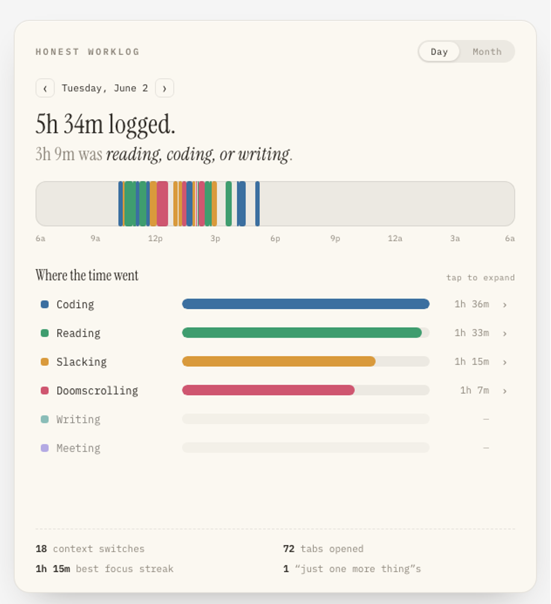
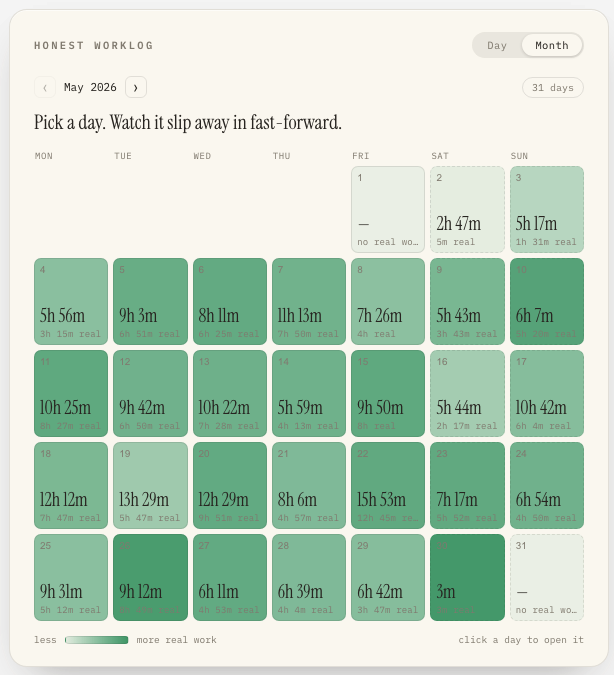

# Honest Worklog

A small self-hosted widget that turns my real machine activity — Claude Code
sessions, Chrome history, VS Code edits, macOS focus events — into an honest
daily PhD worklog. No self-reporting, no manual tagging.

**Live demo:** <https://adaren100.github.io/worklog/>




## Files

- `build_data.py` — pulls activity from `~/.claude/projects`, Chrome history,
  VS Code edit history, and macOS `knowledgeC.db`; categorises domains
  (static rules + LLM fallback); writes `data.js`.
- `Honest Worklog.html` — entry page; loads `data.js` and the widgets below.
- `widget.jsx` — day view.
- `month.jsx` — month overview.
- `tweaks-panel.jsx` — inline editor for categories / events.
- `data.js` — generated; example month included so the widget renders out of
  the box.

## Run

```bash
cp .env.example .env   # add your ANTHROPIC_API_KEY (only needed for unknown-domain LLM fallback)
python3 build_data.py  # defaults: current month, Australia/Sydney
python3 -m http.server 1314
open http://localhost:1314/Honest%20Worklog.html
```

`build_data.py 2026 5` builds a specific month.

## Permissions (macOS)

For full coverage, grant **Full Disk Access** to your terminal so
`knowledgeC.db` is readable. Without it, the script still works — it just
falls back to Chrome/VS Code/Claude sources only.

## Notes

- `domain_cats.json` is a per-user cache of LLM verdicts on unknown domains
  and is gitignored.
- Timezone and "logical day start" (default 06:00) are constants at the top
  of `build_data.py`.
